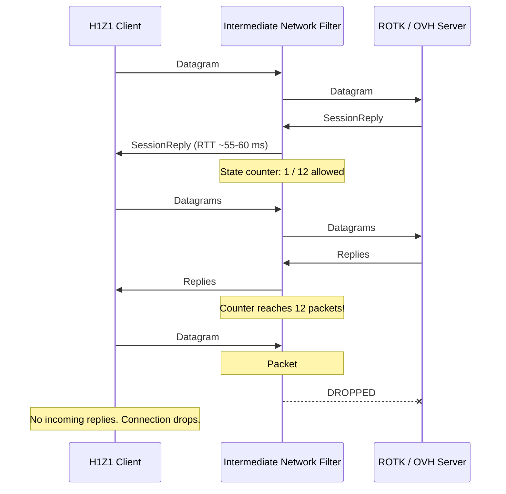
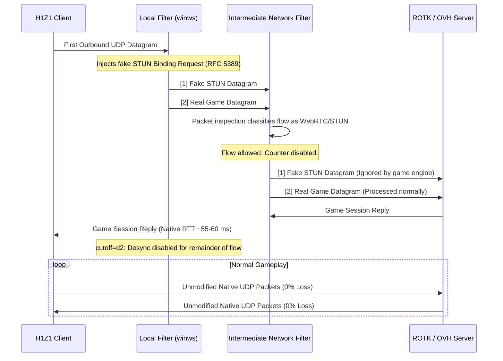
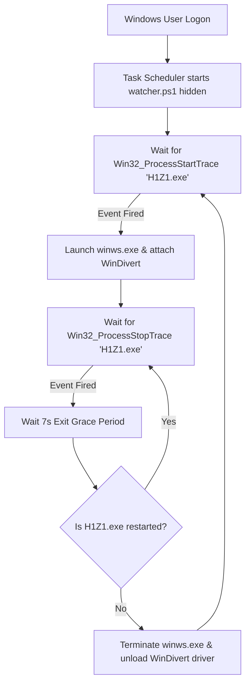

# How It Works: Technical Architecture

This document describes the root cause of the UDP flow termination observed on tested Russian ISP connections when playing H1Z1 ROTK, and explains how this local desync solution keeps the connection stable without a VPN.

---

## 1. The Direct UDP Problem

When H1Z1 connects to ROTK game servers hosted on foreign datacenters (specifically OVH in Western Europe), the network flow establishes an initial UDP handshake:



### Observed Characteristics:
- **Strict Packet Counter**: On the tested Beeline connection, flow termination did not trigger based on a time duration or bandwidth limit. Probing at 1 packet per second survived for 11+ seconds before cutting off on packet #13. Probing at 10 packets per second was cut off after ~1.16 seconds.
- **Selective Protocol Filtering**: Known protocol flows (such as standard DNS or WebRTC/STUN traffic) are not subjected to this counter restriction.
- **Target Specificity**: Non-OVH game servers and Russian domestic endpoints operated with 0% packet loss, confirming the restriction specifically impacts foreign hosting subnets (OVH `AS16276`).

---

## 2. The STUN Desync Solution

VLESS was playable and often stayed around roughly 60–80 ms, but the tunneled path introduced noticeable jitter and occasional latency spikes reaching approximately 140–170 ms on the tested setup. The direct local bypass keeps the native route and produced a much steadier ~55–61 ms connection.

Instead of tunneling game traffic through a foreign proxy, we apply a local packet-level desynchronization using `winws` and the kernel packet interception driver `WinDivert`.



### Key Technical Details:
1. **Single-Packet Handshake Prefix (`cutoff=d2`)**:
   `winws` injects a standard 100-byte STUN Binding Request (`stun.bin`, opcode `0x0001` with magic cookie `0x2112A442`) on the very first datagram of the flow.
2. **Intermediate Filter Classification**:
   The network filter inspects the first packet, matches the STUN header, and marks the entire 5-tuple as an authorized real-time voice/video/WebRTC communication.
3. **Server-Side Safety**:
   The ROTK server running on Linux receives the STUN datagram on port 20141 or 20214. Because the SOE/Daybreak game protocol engine does not recognize the STUN opcode, the server simply discards the STUN datagram and immediately processes the legitimate `SessionRequest` datagram right behind it.
4. **Zero Overhead for Active Gameplay**:
   Because of `--dpi-desync-cutoff=d2`, the desynchronization mechanism shuts off after the second packet of the flow. All subsequent game datagrams are passed 100% untouched at native wire speed directly to your physical network interface.
5. **Inbound Path Untouched**:
   The WinDivert filter captures only `outbound` traffic. Inbound packets from ROTK servers travel directly from your physical NIC to `H1Z1.exe` without passing through WinDivert, ensuring minimal latency and zero packet loss.

---

## 3. Server Endpoints & Dynamic Match Allocation

During live testing, two distinct server groups were discovered:

| Service | Destination IP | Destination Ports | Role |
| :--- | :--- | :--- | :--- |
| **Login & Gateway** | `162.19.94.95` | `20042-20045`, `20140-20141` | Account login, character selection, lobby menu |
| **Game Match Servers** | `162.19.126.0/24` | `20000 - 23000` | Dynamic match server instances (e.g. `162.19.126.166:20214`) |

By expanding the filter to cover the complete `/24` subnet:
```text
(ip.DstAddr == 162.19.94.95 or (ip.DstAddr >= 162.19.126.0 and ip.DstAddr <= 162.19.126.255)) and ((udp.DstPort >= 20000 and udp.DstPort <= 23000))
```
Every match instance allocated by the ROTK infrastructure is automatically protected, while 100% of all other PC traffic (Discord, Steam, web browsers, DNS) remains completely excluded from the filter.

---

## 4. Event-Driven Auto Mode Architecture (v1.2.0)

To avoid keeping a network packet filter permanently active on the system, `v1.2.0` introduces a fully automated, headless lifecycle manager (`watcher.ps1`):



- **Event-Driven**: Uses WMI kernel event listeners (`Win32_ProcessStartTrace` and `Win32_ProcessStopTrace`) instead of polling loops. CPU consumption is practically 0%.
- **Exit Grace Period**: When `H1Z1.exe` exits, the watcher waits 7 seconds before terminating `winws`. If the game was quickly restarted (e.g. after a crash or game setting change), the bypass remains active without dropping the driver.
- **Zero GUI / Completely Headless**: Runs silently in the background with no taskbar icons or open console windows.
- **Driver Cleanliness**: Whenever the game is not running, the WinDivert driver is fully unloaded from kernel space.
